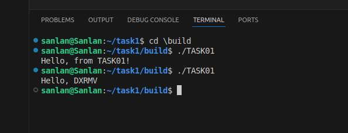

# XJTU-RMV projects
this is my project in XJTU-RMV

## task01
the task01 need me install ubuntu successfully ,configure the C++ language environment and write a C++ code

here's my images of installing ubuntu and running the C++ code successfully:

