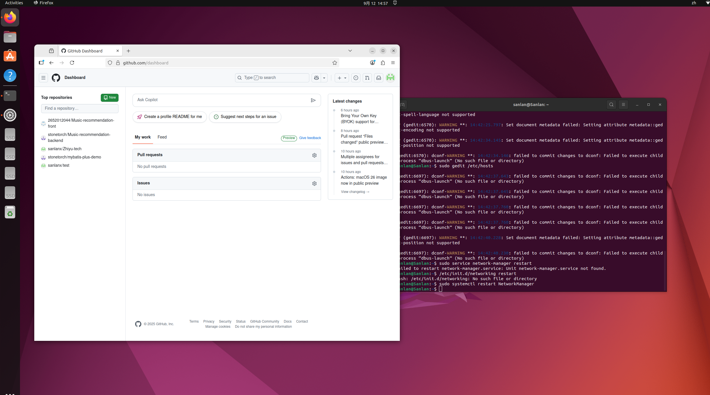
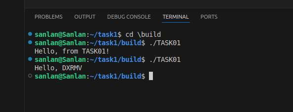

## task01
the task01 need me install ubuntu successfully ,configure the C++ language environment and write a C++ code

here's my images of installing ubuntu and running the C++ code successfully:

the image above shows that I have successfully installed ubuntu and am able to run commands in the terminal

the image above shows the execution results of my C++ program built with Cmake
