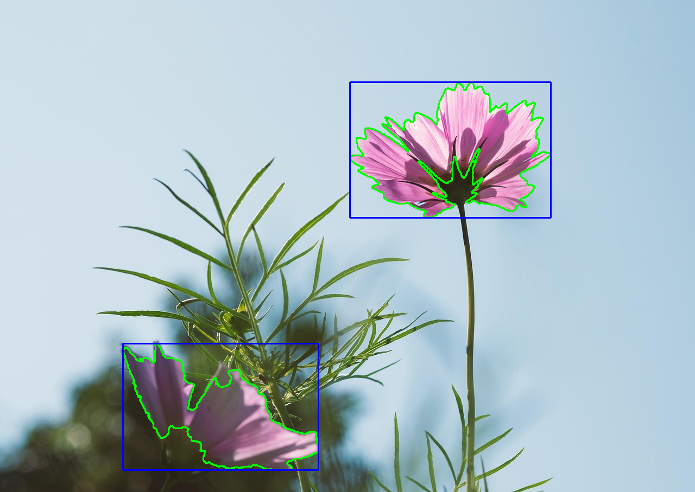
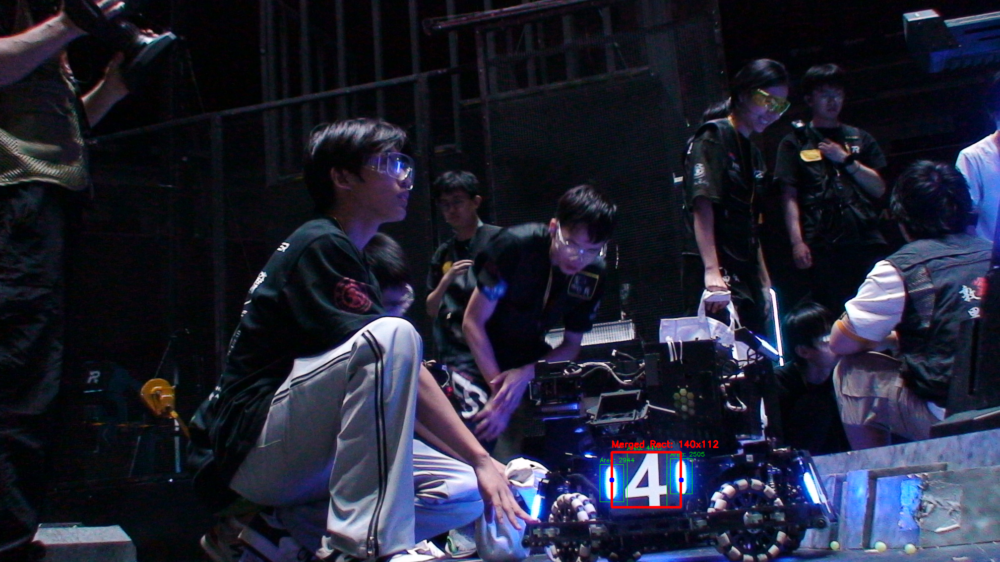

# task02
## 遇到的问题
### opencv install
`find_package(OpenCV REQUIRED)`  
`include_directories(${OpenCV_INCLUDE_DIRS})`  
`target_link_libraries(task2 ${OpenCV_LIBS})`  
以上代码应该放在项目的CMakeLists.txt中，并改为自己的项目名称

### 特征提取不完全
刚开始时提取的红字特征不完全，通过对mask范围的不断调整，实现了较好的提取


包括后面对装甲板区域的识别，也存在类似问题  
在此附上HSV的基本颜色分量范围：https://cloud.tencent.com/developer/article/1199352

## 完成思路
对于基础的图片处理部分，通过查阅培训PDF内容以及查阅相关函数参数的意义，完成的较为顺利

对于识别装甲板，  
对图片进行颜色空间转换，变为HSV格式  
定义蓝色HSV范围以及对应的掩码  
用开运算和闭运算进行降噪和填充黑洞处理  
钩勒轮廓  
对矩形进行筛选，选出符合的矩形  
将符合条件的矩形进行合并，得到最终结果


## 知识点记录
### 高斯模糊
`GaussianBlur(img, gaussianImg, Size(5, 5), 1.5);`  
1.5这个值表示高斯核在X方向的标准差（Sigma）  
如果sigma=0：OpenCV会根据核大小自动计算一个合适的sigma值

### 特征提取
#### 颜色提取
红色的HSV范围在0度——180度附近，因此需要定义两个范围  
`redMask = mask1 | mask2;`  用于合并两个范围  
inRange函数用于提取位于特定颜色区域的像素点  

HSV在opencv中为3通道，Scalar(H色调，S饱和度，V明度)  
S:70-255：饱和度足够高的颜色（排除灰色）  
V:50-255：亮度足够亮的颜色（排除太暗的）

`void bitwise_and(InputArray src1, InputArray src2, OutputArray dst, InputArray mask = noArray());`  
src1 = src：原始图像  
src2 = src：原始图像（与自己进行AND操作）  
dst = redRegion：输出结果图像

```
// 伪代码表示实际执行逻辑  
for 每个像素位置 (x,y):  
    if (redMask.at<uchar>(y,x) != 0):  // 如果掩膜不为0  
        redRegion.at<Vec3b>(y,x) = src.at<Vec3b>(y,x) & src.at<Vec3b>(y,x)  // 即原像素  
    else:  
        redRegion.at<Vec3b>(y,x) = 0   // 设为黑色
```

#### 外轮廓提取
`vector<vector<Point>> contours;`  外轮廓点集  
`vector<Vec4i> hierarchy;`  轮廓层次信息（next, previous, first_child, parent）  
`findContours(redMask, contours, hierarchy, RETR_EXTERNAL, CHAIN_APPROX_SIMPLE);`  
RETR_EXTERNAL：只检测最外层轮廓  
CHAIN_APPROX_SIMPLE：压缩轮廓点，节省内存

#### 漫水处理
用于填充相连的相似颜色区域  
选择起点 -> 比较颜色 -> 填充扩散 -> 持续扩展

// 基本用法  
`floodFill(image, seedPoint, newColor);`  
// 完整参数  
`floodFill(image, mask, seedPoint, newColor, &rect, loDiff, upDiff, flags);`

缺点：对噪声敏感，需要手动选择种子点，可能过渡填充或者填充不足

### 图像处理
#### 旋转
计算旋转中心 -> 将旋转的中心设置为图像的正中心  
`Point2f center(src.cols / 2.0f, src.rows / 2.0f);`  
src.cols / 2.0f：图像宽度的中心点  
src.rows / 2.0f：图像高度的中心点  

生成旋转矩阵  
`Mat rotationMatrix = getRotationMatrix2D(center, 35.0, 1.0);`  
1.0是指缩放比例

应用旋转  
`warpAffine(src, rotatedImage, rotationMatrix, src.size());`

#### 图像裁减
`Rect cropRegion(0, 0, src.cols / 2, src.rows / 2);`  
Rect：矩形区域，参数为 (x, y, width, height)  
示例代码定义了原图左上1/4的区域

`Mat croppedImage = src(cropRegion);`  
执行裁减，但是原图会被影响  
在上面代码后面加上`.clone()`可以避免影响原图


